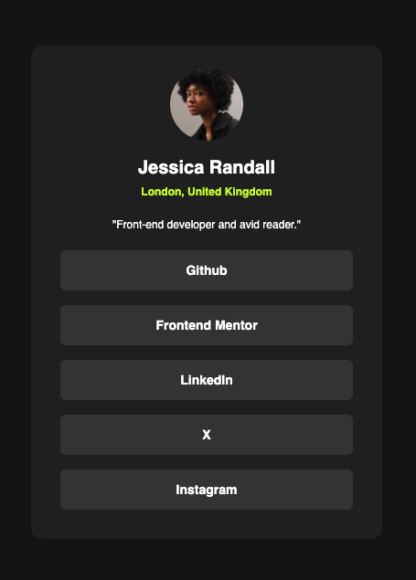

# Frontend Mentor - Social links profile solution

This is a solution to the [Social links profile challenge on Frontend Mentor](https://www.frontendmentor.io/challenges/social-links-profile-UG32l9m6dQ). Frontend Mentor challenges help you improve your coding skills by building realistic projects.

## Table of contents

- [Overview](#overview)
  - [The challenge](#the-challenge)
  - [Screenshot](#screenshot)
  - [Links](#links)
- [My process](#my-process)
  - [Built with](#built-with)
  - [What I learned](#what-i-learned)
- [Author](#author)

## Overview

### The challenge

Users should be able to:

- See hover and focus states for all interactive elements on the page

### Screenshot

### Links

- [Solution URL](https://www.frontendmentor.io/solutions/social-links-profile-react-and-tailwind-css-rcxKRBGuBX)
- [Live Site URL](https://social-links-ten-ebon.vercel.app/)

## My process

### Built with

- HTML
- [Tailwind CSS](https://tailwindcss.com/) - CSS framework
- [React](https://reactjs.org/) - JS library
- [Vite](https://vitejs.dev/) - Frontend tool for building web apps

### What I learned

I learned about configuring the `tailwind.config.js` file a a bit more in depth. I also practiced layouts and the css box model.

## Author

- Website - [Justin Levy](https://www.justlevy.com)
- Frontend Mentor - [@justinsane](https://www.frontendmentor.io/profile/justinsane)
- X - [@just_levy](https://www.x.com/just_levy)
